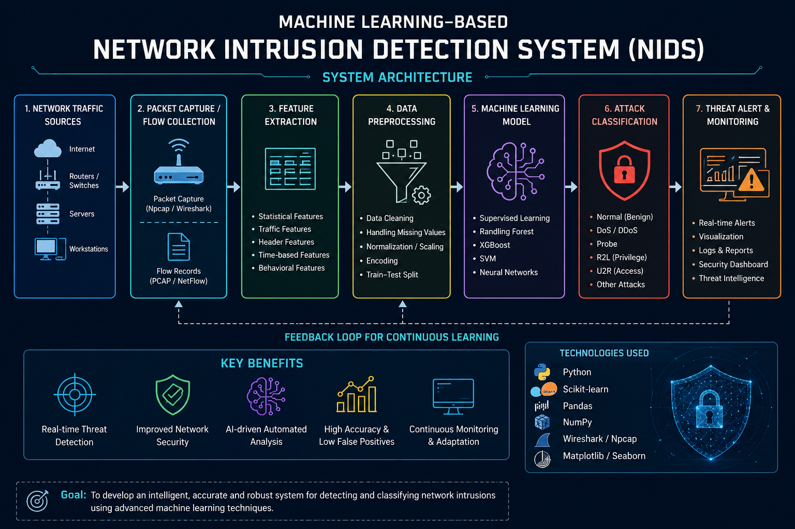
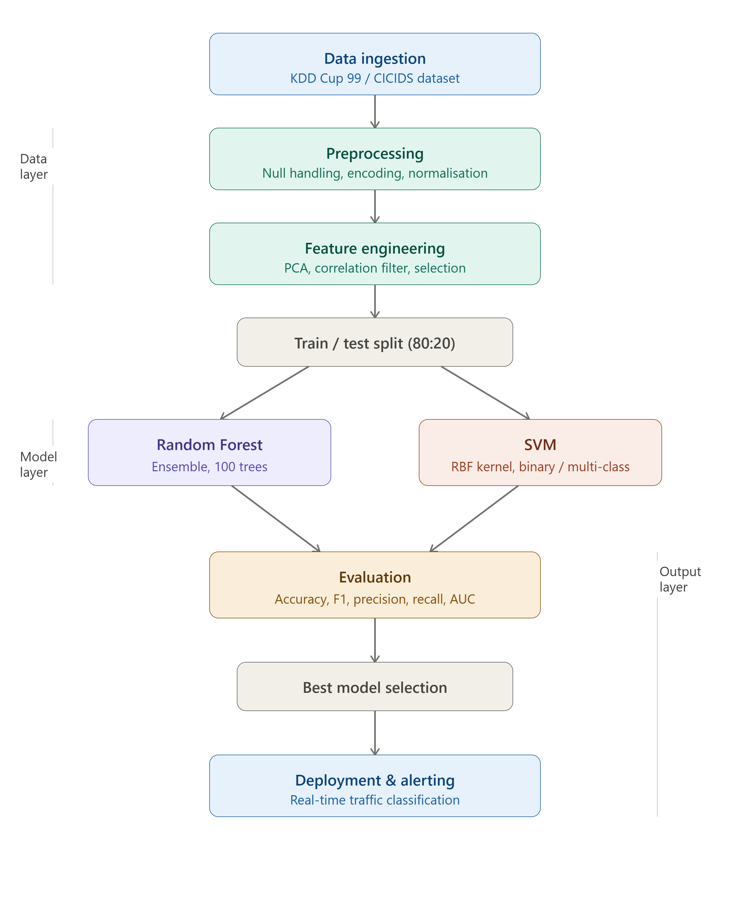
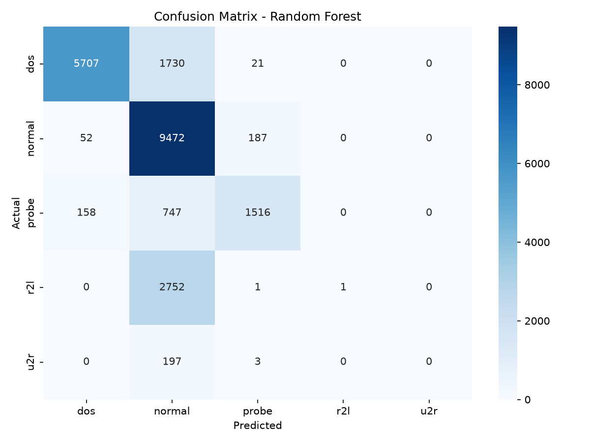
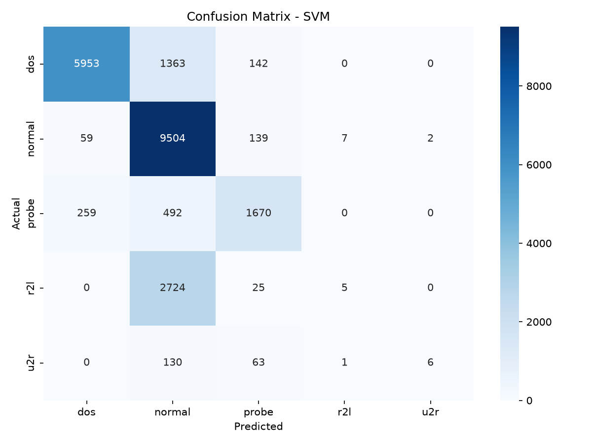

<p align="center">
  
</p>

# ML-Based Network Intrusion Detection System (NIDS)

<p align="center">


</p>

---

## 📌 Project Overview

The **Machine Learning-Based Network Intrusion Detection System (NIDS)** is an AI-driven cybersecurity research project designed to identify malicious network activities and distinguish them from legitimate traffic.

The system analyzes network flow characteristics using machine learning algorithms to detect and classify different categories of cyber threats. The project explores the application of AI techniques for automated threat intelligence, anomaly detection, and network security monitoring.

---

## 🎯 Objectives

- Develop an ML-based framework for automated network intrusion detection.
- Analyze network traffic features to identify abnormal communication patterns.
- Classify network activities into normal and malicious categories.
- Evaluate machine learning models using standard performance metrics.
- Explore AI-based approaches for improving cybersecurity defense mechanisms.

---

## 🏗️ System Architecture



---

## 🔄 ML Workflow Visualization



---

## 📂 Dataset

This project uses the **NSL-KDD dataset**, a benchmark dataset for Network Intrusion Detection Systems.

| Property | Details |
|----------|---------|
| Dataset | NSL-KDD |
| Training File | `KDDTrain+.txt` |
| Testing File | `KDDTest+.txt` |
| Total Features | 41 |
| Classes | Normal, DoS, Probe, R2L, U2R |

**Dataset structure:**
data/

├── KDDTrain+.txt

└── KDDTest+.txt

---

## 🤖 Machine Learning Models

| Model | Type | Key Parameters |
|-------|------|----------------|
| Random Forest | Ensemble Classifier | 100 trees, max_depth=10 |
| SVM | Kernel-based Classifier | RBF kernel, C=1.0 |

Both models are trained on preprocessed NSL-KDD features after applying normalization and PCA-based feature selection.

---

## 📊 Results & Performance

### Random Forest

| Metric | Score |
|--------|-------|
| Accuracy | 74.06% |
| Precision | 80.93% |
| Recall | 74.06% |
| F1-Score | 69.25% |

### SVM

| Metric | Score |
|--------|-------|
| Accuracy | 76.02% |
| Precision | 74.37% |
| Recall | 76.02% |
| F1-Score | 71.05% |

### Confusion Matrices

| Random Forest | SVM |
|---------------|-----|
|  |  |

> ✅ SVM outperforms Random Forest across all metrics on the NSL-KDD test set.
> ⚠️ R2L and U2R show lower recall due to severe class imbalance in NSL-KDD (known dataset limitation). Future work includes SMOTE oversampling to address this.

---

## 🛡️ Attack Classification

| # | Attack Category | Attack Examples | Dataset Label | ML Model Used | Threat Level |
|---|----------------|-----------------|---------------|---------------|--------------|
| 1 | DoS (Denial of Service) | SYN Flood, Ping of Death, Teardrop | `dos` | Random Forest, SVM | 🔴 High |
| 2 | DDoS (Distributed DoS) | UDP Flood, HTTP Flood, Amplification | `dos` | Random Forest, SVM | 🔴 High |
| 3 | Probe / Scanning | Nmap, Port Scan, IP Sweep | `probe` | Random Forest, SVM | 🟡 Medium |
| 4 | R2L (Remote to Local) | FTP Write, IMAP Attack, Phishing | `r2l` | Random Forest, SVM | 🔴 High |
| 5 | U2R (User to Root) | Buffer Overflow, Rootkit, XTerm | `u2r` | Random Forest, SVM | 🔴 Critical |
| 6 | Brute Force | SSH Brute Force, Password Guessing | `r2l` | SVM | 🟡 Medium |
| 7 | Web Attacks (SQLi, XSS) | SQL Injection, Cross-Site Scripting | `r2l` | SVM | 🔴 High |

---

## ⚙️ Installation & Usage

```bash
# Clone the repository
git clone https://github.com/sunishkasingh04-web/ML-Network-Intrusion-Detection.git
cd ML-Network-Intrusion-Detection

# Install dependencies
pip install -r requirements.txt

# Run the model training
python src/train.py

# Run evaluation
python src/evaluate.py
```

---

## 📁 Project Structure
ML-Network-Intrusion-Detection/

├── assets/

│   ├── nids-banner.png

│   ├── nids-architecture.png

│   └── nids-ml-workflow.png

├── data/

│   ├── KDDTrain+.txt

│   └── KDDTest+.txt

├── notebooks/

│   └── exploration.ipynb

├── src/

│   ├── train.py

│   └── evaluate.py

├── models/

│   └── nids_model.pkl

├── results/

│   └── evaluation_report.txt

└── README.md

---

## 🚀 Future Enhancements

- Integrate deep learning models (LSTM, Autoencoder) for anomaly detection.
- Deploy as a real-time packet inspection module using Scapy.
- Build a lightweight dashboard for live traffic monitoring.
- Extend dataset support to CICIDS 2017/2018 for broader attack coverage.
- Explore federated learning for privacy-preserving intrusion detection.

---

## 👨‍💻 Author

**Sunishka Singh**
- 🔗 GitHub: [@sunishkasingh04-web](https://github.com/sunishkasingh04-web)
- 📧 Research Prototype | Cybersecurity & AI